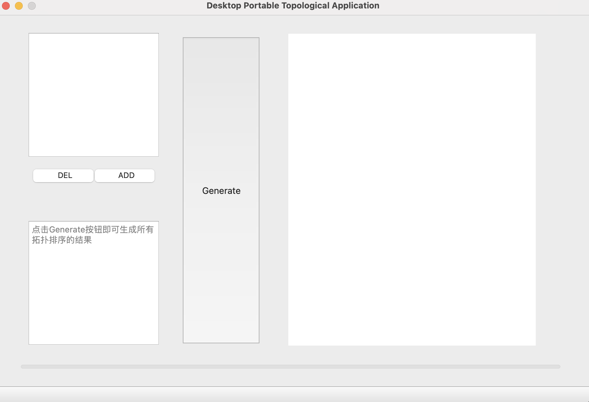
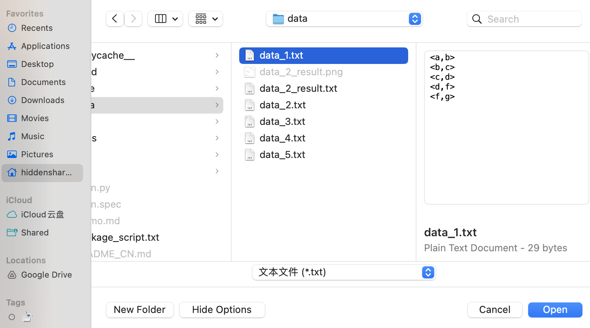
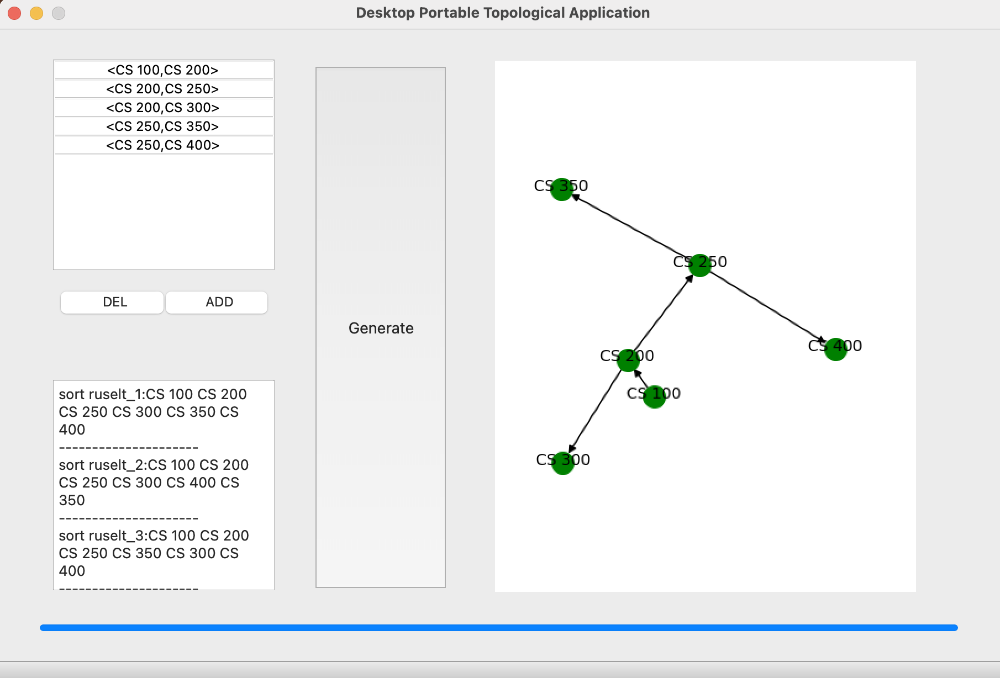
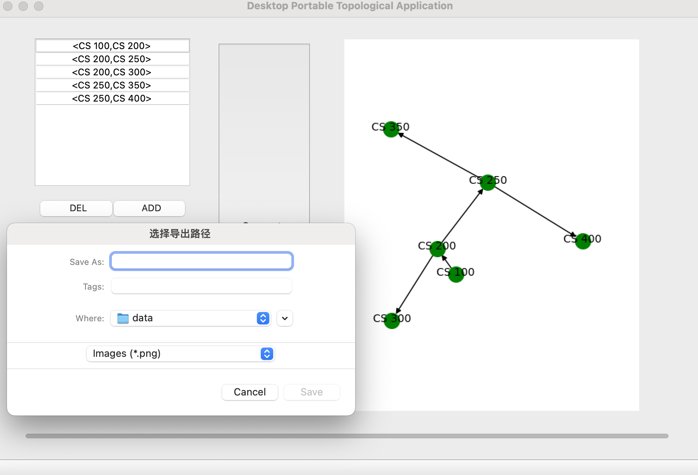
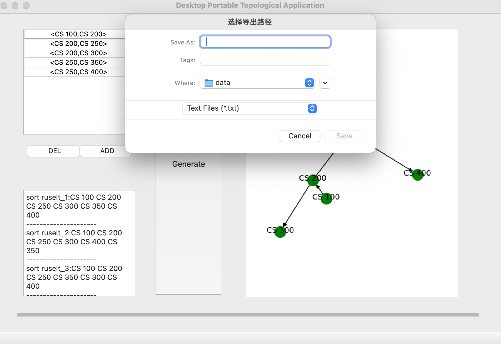

<!--
 * @Author: SheathedSharp z404878860@163.com
 * @Date: 2024-06-06 13:02:56
-->
# Desktop-portable-topological-sorting-application
<div align="center">
  
  [](https://github.com/SheathedSharp/Desktop-portable-topological-sorting-application/blob/main/README_CN.md)    |  [](https://github.com/SheathedSharp/Desktop-portable-topological-sorting-application?tab=readme-ov-file)  
  
</div>

## Running Environment
- **OS**: Mac / Windows
- **Interpreter**: Python v3.9
- **External Libraries**: PySide2 v5.15.2.1, networkx v2.5.1, matplotlib v3.3.4
- **GUI Tool**: QtDesigner

## Project Structure

```commandline
TopologicalSort_app
├─build(packaged software)
├─core (core algorithms)
├─data (imported file information)
├─dist (different versions of the released software)
├─docs (all documentation)
├─statics (static resources)
```

## Quick Deployment
- First, create a virtual environment by entering the command `mamba create -n "your-env-name" python=3.9` to create a virtual environment named "your-env-name".
- Activate the newly created virtual environment by entering the command `conda activate "your-env-name"`.
- Install external dependencies by entering the command `mamba install --file requirements.txt`.

## User Guide
- Using the previously created environment, run the main file with the command `python main.py`.



- Select the file to import, or manually input data in a specified format to add.



- After completing the data input, click the `generate` button to perform the topological sorting.



- The bottom left will display the result of the topological sort, and the right side will show the topological graph.
- You can choose to export the topological result (.txt) or the topological graph (.png).



